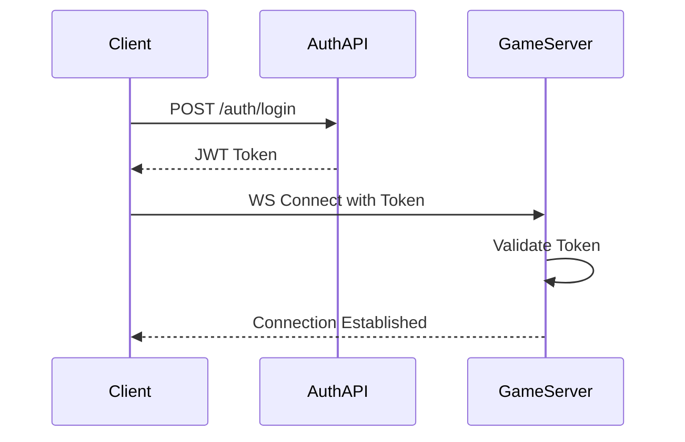
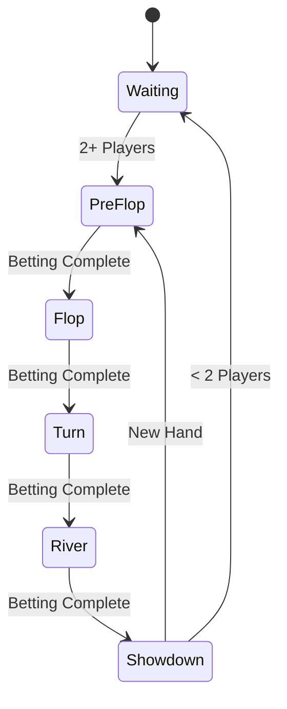

# Technical Architecture Document
## Real-Time Poker Platform

### 1. System Components

#### 1.1 Frontend (Next.js)
```
/web
├── /app                 # Next.js app directory
│   ├── /auth           # Authentication pages
│   ├── /game           # Game interface
│   └── /layout.tsx     # Root layout
├── /components         # React components
│   ├── /game          # Game-related components
│   ├── /ui            # UI components
│   └── /shared        # Shared components
├── /lib                # Utility functions
│   ├── /websocket     # WebSocket client
│   ├── /auth          # Authentication utilities
│   └── /game          # Game logic utilities
└── /types             # TypeScript type definitions
```

#### 1.2 Authentication Server (Go/Gin)
```
/api
├── /cmd               # Entry points
│   └── /api          # API server
├── /internal         # Internal packages
│   ├── /auth        # Authentication logic
│   ├── /config      # Configuration
│   └── /middleware  # HTTP middleware
└── /pkg             # Public packages
```

#### 1.3 Game Server (Go/WebSocket)
```
/game
├── /cmd              # Entry points
│   └── /game        # Game server
├── /internal        # Internal packages
│   ├── /game       # Game logic
│   │   ├── deck.go    # Card deck management
│   │   ├── table.go   # Table management
│   │   ├── player.go  # Player management
│   │   └── rules.go   # Game rules
│   ├── /websocket  # WebSocket handling
│   └── /config     # Configuration
└── /pkg            # Public packages
```

### 2. Data Structures

#### 2.1 Game State
```go
type GameState struct {
    TableID        string                 // Unique table identifier
    Status         GameStatus             // Current game status
    Players        map[int]*Player        // Seated players
    Spectators     map[string]*Player     // Watching players
    Deck           []string               // Card deck
    CommunityCards []string               // Community cards
    Pot           int                    // Current pot
    CurrentBet    int                    // Current bet to call
    DealerPos     int                    // Dealer position
    CurrentPos    int                    // Current player position
    LastRaisePos  int                    // Last raising player position
    Round         BettingRound           // Current betting round
}
```

#### 2.2 Player State
```go
type Player struct {
    ID       string
    Username string
    Conn     *websocket.Conn
    Seat     int
    Chips    int
    Bet      int
    Cards    []string
    Status   PlayerStatus
}
```

### 3. Communication Protocol

#### 3.1 WebSocket Message Structure
```go
type Message struct {
    Type    string          `json:"type"`
    Payload json.RawMessage `json:"payload"`
}

type GameStateMessage struct {
    TableID        string    `json:"table_id"`
    Players        []Player  `json:"players"`
    Spectators     []Player  `json:"spectators"`
    CommunityCards []string  `json:"community_cards"`
    Pot           int       `json:"pot"`
    CurrentBet    int       `json:"current_bet"`
    CurrentPlayer string    `json:"current_player"`
    DealerPos     int       `json:"dealer_position"`
    Status        string    `json:"status"`
}
```

### 4. Authentication Flow



### 5. Game Flow



### 6. Implementation Details

#### 6.1 WebSocket Connection Management
```go
func handleWebSocket(w http.ResponseWriter, r *http.Request) {
    conn, err := upgrader.Upgrade(w, r, nil)
    if err != nil {
        log.Printf("Upgrade error: %v", err)
        return
    }
    
    player := &Player{
        Conn: conn,
        // ... initialize player
    }
    
    go handlePlayer(player)
}

func handlePlayer(player *Player) {
    defer func() {
        player.Conn.Close()
        removePlayer(player)
    }()
    
    for {
        var msg Message
        err := player.Conn.ReadJSON(&msg)
        if err != nil {
            break
        }
        
        handleMessage(player, msg)
    }
}
```

#### 6.2 Game State Management
```go
func (t *Table) StartHand() {
    t.mutex.Lock()
    defer t.mutex.Unlock()
    
    t.deck = newShuffledDeck()
    t.dealHoleCards()
    t.postBlinds()
    t.currentPos = (t.dealerPos + 3) % MaxPlayers
    
    t.broadcastGameState()
}

func (t *Table) handlePlayerAction(p *Player, action PlayerAction) {
    t.mutex.Lock()
    defer t.mutex.Unlock()
    
    if !t.isValidAction(p, action) {
        return
    }
    
    t.applyAction(p, action)
    t.moveToNextPlayer()
    
    if t.isRoundComplete() {
        t.advanceRound()
    }
    
    t.broadcastGameState()
}
```

### 7. Error Handling

#### 7.1 WebSocket Errors
```go
func handleWSError(player *Player, err error) {
    if websocket.IsUnexpectedCloseError(err) {
        removePlayer(player)
        return
    }
    
    if _, ok := err.(*websocket.CloseError); ok {
        removePlayer(player)
        return
    }
    
    // Handle other errors
    log.Printf("WebSocket error: %v", err)
}
```

#### 7.2 Game Logic Errors
```go
func (t *Table) validateAction(p *Player, action PlayerAction) error {
    if !t.isPlayerTurn(p) {
        return ErrNotPlayerTurn
    }
    
    if !t.isValidActionType(action) {
        return ErrInvalidActionType
    }
    
    if !t.isValidActionAmount(action) {
        return ErrInvalidActionAmount
    }
    
    return nil
}
```

### 8. Testing Strategy

#### 8.1 Unit Tests
- Game logic
- Hand evaluation
- Betting rules
- Player actions

#### 8.2 Integration Tests
- WebSocket communication
- Game flow
- Player interactions
- Error handling

#### 8.3 End-to-End Tests
- Complete game scenarios
- Multiple player interactions
- Edge cases
- Performance testing 